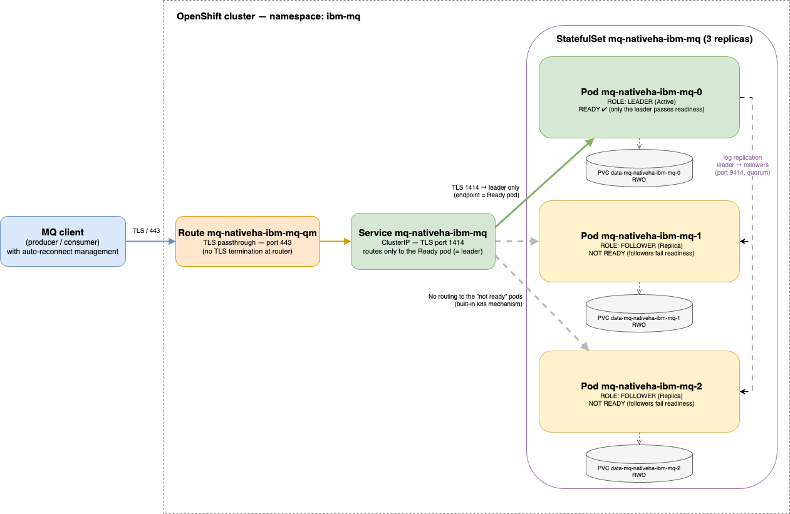

# IBM MQ Native HA on OpenShift — Demo

A self-contained, configuration-as-code demo of an **IBM MQ Native HA** queue
manager on OpenShift, secured with a mutual-TLS IAM model (certificate-based
authentication + fine-grained per-queue authorization), together with a Java
JMS client pair used to validate high availability and message ordering across
a Native HA leader failover.

The whole stack is declarative: the queue manager, its certificates, its
security policy, and the test clients are all deployed from YAML manifests via
`oc`/`kubectl` — no manual configuration on the running queue manager.

## Repository layout

| Path | Contents |
|---|---|
| [`manifests/`](manifests/README.md) | The IBM MQ Native HA queue manager: operator subscription, cert-manager issuers/certificates, TLS, the `UserExternal` security policy, and the MQSC queue/channel/CHLAUTH/AUTHREC definitions that implement the IAM model. |
| [`mq-test/`](mq-test/README.md) | A minimal Java JMS producer/consumer pair (shared code and image, role selected by env var) plus its build pipeline and deployment manifests, used to verify automatic client reconnection and message ordering through a failover. |

Each directory has its own README with the full design rationale and
step-by-step instructions — start there for details.

## Highlights

- **Native HA** — three-replica queue manager with automatic leader election;
  clients reconnect transparently via the MQ client library's built-in
  automatic reconnection.
- **Certificate-based authentication** — `CHLAUTH SSLPEERMAP` maps each
  client's TLS certificate Subject DN to an MQ identity; no shared passwords or
  CCDT-embedded secrets.
- **Fine-grained authorization** — per-principal `AUTHREC` grants restrict the
  producer to `PUT` and the consumer to `GET`/`BROWSE` on `TEST.QUEUE`.
- **No OS users, no LDAP, no `group 0`** — `SecurityPolicy=UserExternal`
  (MQ 9.3+) lets the OAM authorize certificate-mapped principals that have no
  backing OS account, all within OpenShift's `restricted-v2` SCC.
- **End-to-end TLS** — mutual TLS through an OpenShift passthrough Route, with
  the SNI handling required to make the MQ app channel work through the router.

## Native HA architecture

The queue manager is deployed by the IBM MQ Operator as a three-replica
**StatefulSet** (`mq-nativeha-ibm-mq`). The three pods form a quorum group with a
single elected **leader** (`Active`) and two **followers** (`Replica`); together
they implement Native HA — MQ's built-in, storage-independent replication, with
no shared volume between pods.

> Open [`manifests/native-ha-architecture.drawio`](manifests/native-ha-architecture.drawio)
> with [diagrams.net](https://app.diagrams.net/) (or the VS Code Draw.io
> extension) to view/edit the diagram.

**Pods and storage.** Each pod runs one `qmgr` container and binds its own
**`ReadWriteOnce`** PVC (`data-mq-nativeha-ibm-mq-{0,1,2}`), provisioned per pod
from the StatefulSet's `volumeClaimTemplate`. Because each replica keeps a full,
independently-replicated copy of the queue manager's data, RWO block storage is
sufficient — there is no shared `ReadWriteMany` filesystem.

**Roles — leader vs followers.** Exactly one pod is the leader and owns the live
queue manager; the followers stay in lock-step. The leader streams its recovery
log to the followers over the replica services
(`mq-nativeha-ibm-mq-replica-{0,1,2}`, port **9414**); a write is acknowledged
only once a quorum (2 of 3) has it, so a follower can take over with no data
loss.

**Health probes.** The container exposes three MQ-native probes that the operator
wires in:

- `chkmqstarted` (**startup**) — gates the other probes until MQ has come up.
- `chkmqhealthy` (**liveness**) — restarts a pod whose queue manager is unhealthy.
- `chkmqready` (**readiness**) — **passes only on the leader**. This is the
  linchpin of client routing: followers are intentionally *Not Ready*, so they
  are never an endpoint of the client Service.

**TLS and ports.** TLS is **terminated at the pod**, not at the router: each
`qmgr` container serves the MQ app channel on port **1414** over TLS (server
cert from `mq-nativeha-server-tls`, client certs trusted via the clients CA).
Ports 9414 (replication) and 9157 (metrics) are internal.

**Client routing.** The client Service `mq-nativeha-ibm-mq` (ClusterIP, port
**1414**) selects only the **Ready** pod — i.e. the leader — so client traffic
always lands on the active instance. Externally, the Route
`mq-nativeha-ibm-mq-qm` is **TLS passthrough on port 443** → Service 1414; the
router forwards encrypted bytes untouched, so the end-to-end mutual TLS
handshake happens directly between the client and the leader pod.

**Failover.** If the leader pod or node fails, its readiness drops, the Service
removes it as an endpoint, the remaining followers elect a new leader, that pod
becomes Ready, and the Service repoints to it — all automatically. Clients
reconnect transparently via the MQ client library's built-in automatic
reconnection.

## Quick start

All steps assume `oc` is logged into the target OpenShift cluster.
Domain names, namespaces, and the IBM entitlement key are cluster-specific —
replace them before reuse.

1. **Deploy the queue manager** — follow [`manifests/README.md`](manifests/README.md)
   to subscribe the operator, generate certificates, and apply the
   `QueueManager` CR. Wait until the queue manager is `Running`.
2. **Run the validation clients** — follow [`mq-test/README.md`](mq-test/README.md)
   to build the image in-cluster, deploy the producer/consumer, trigger a
   Native HA failover, and confirm message ordering is preserved.

## Prerequisites

- An OpenShift cluster with the IBM MQ Operator available and
  [cert-manager](https://cert-manager.io/) installed.
- An IBM entitlement key from the
  [IBM Container Software Library](https://myibm.ibm.com/products-services/containerlibrary)
  to pull the MQ images.
- `oc` (or `kubectl`) configured for the cluster.

No local Maven, Docker, or JDK is required — the test client image is built
in-cluster from a binary `BuildConfig`.

## License

Licensed under the [Apache License 2.0](LICENSE).
